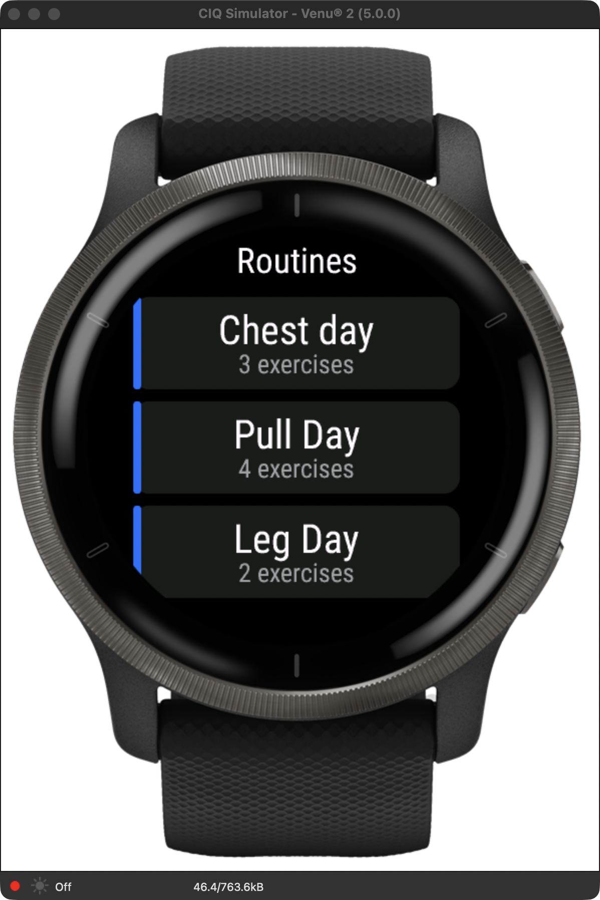
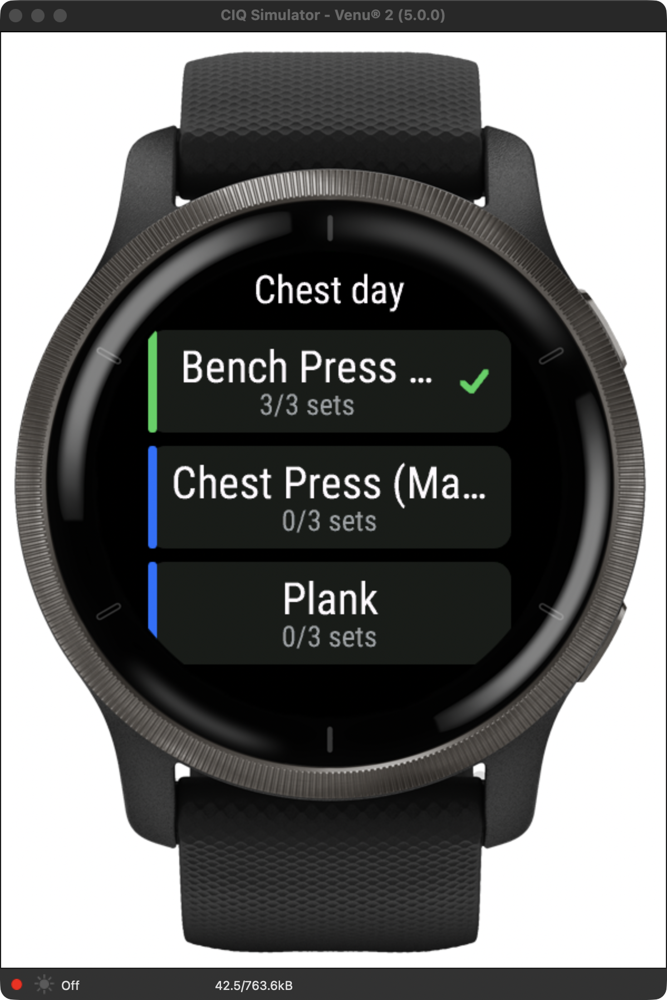
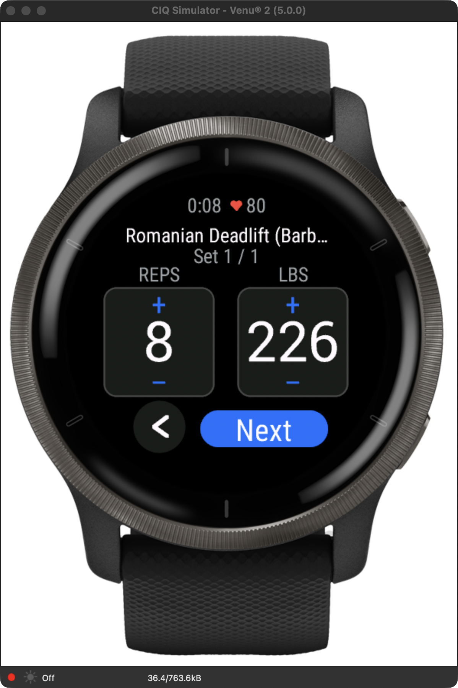
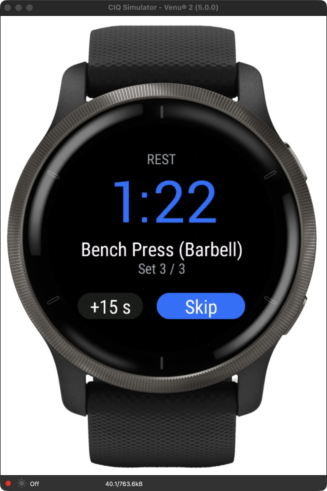
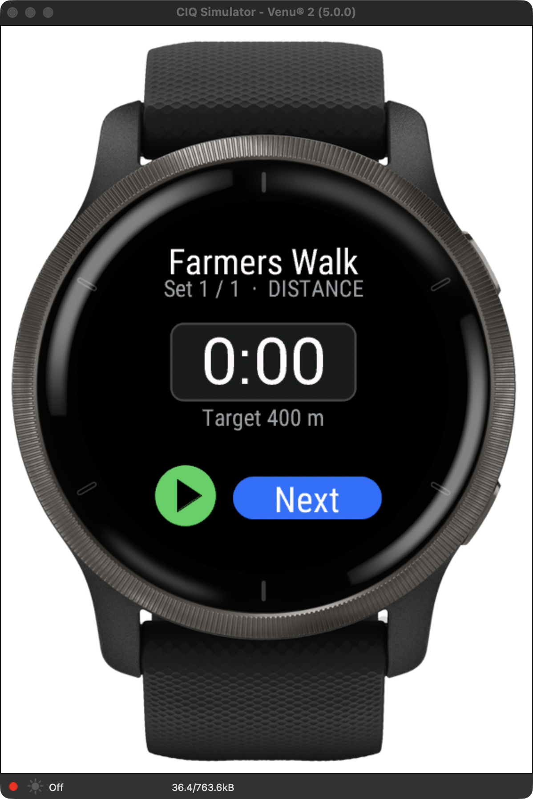
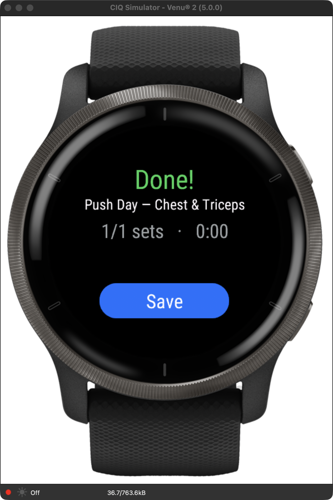

# Workouts for Hevy — Garmin watch app

Run your [Hevy](https://hevy.com) routines on a **Garmin Venu 2** — guided sets,
rests and timers, logged back to Hevy. Heart rate and calories are recorded to
**Garmin Connect**.

Hevy ships a workout companion for the Apple Watch but nothing for Garmin. This
is that missing app: a native **Connect IQ** (Monkey C) watch-app that pulls your
routines from the Hevy API, walks you through each set on the wrist, and posts the
finished workout back.

> **Unofficial.** Not affiliated with Hevy or Garmin. Uses the public Hevy API.

<p align="center">
  
  
  
</p>
<p align="center">
  
  
  
</p>

## Features

- 📋 **Your routines, live** from Hevy — all pages, not just the first ten.
- ✅ **Exercise list** with per-exercise set progress and completion checks.
- 🔢 **Guided sets** — tap to adjust reps and weight, confirm, move on.
- ⏱️ **Rest countdown** (+15 s) and a **timer** for duration and distance sets.
- 💾 **Logs back to Hevy** — and if the phone is away, the workout is kept and
  offered for resending on the next launch. Nothing is lost.
- ❤️ **Heart rate & calories → Garmin Connect** via a recorded strength activity.
- ⚖️ **kg or lbs**, following the watch's unit setting.
- 🔒 **Private by default** — workouts are posted privately unless you opt in.
- ⌚ **On-watch API-key entry** (or set it in the Garmin Connect phone app).
- 🧪 Built-in **demo routine** to try the flow with no key (never posted to Hevy).

## How it works

Two destinations, because neither takes everything:

| Data | Goes to | Why |
|------|---------|-----|
| Sets: weight, reps, duration, distance | **Hevy** (`POST /v1/workouts`) | Hevy's API has no heart-rate field |
| Heart rate, calories, time | **Garmin Connect** (recorded activity) | Connect IQ can't write structured sets to a FIT |

See [`docs/adr/`](docs/adr/README.md) for the decisions and trade-offs.

## Requirements

- A **Garmin Venu 2** (layouts are round-display / 416×416; other round devices
  are a small step away).
- A **Hevy API key** — [hevy.com/settings?developer](https://hevy.com/settings?developer)
  (requires **Hevy Pro**).
- To build: the **Connect IQ SDK** and a developer key.

## Build & run

```bash
./build.sh                          # -> bin/HevyWorkout.prg (venu2)

connectiq &                         # launch the Connect IQ simulator
monkeydo bin/HevyWorkout.prg venu2  # load the app
```

`build.sh` expects the SDK at `~/.Garmin/ConnectIQ/Sdks/connectiq-sdk-mac-<ver>`
and a `developer_key.der` in the project root
(`openssl genrsa 4096` → pkcs8 DER). See [`CLAUDE.md`](CLAUDE.md) for macOS
toolchain gotchas.

## Install on the watch

Copy `bin/HevyWorkout.prg` to `GARMIN/APPS/` over USB (Android File Transfer on
macOS), or publish via the Connect IQ Store.

## Configure the API key

Either:

- **On the watch** — the first-run setup screen lets you type the key. The
  keyboard caps length, so type the 32 letters/digits in chunks; the hyphens are
  inserted automatically and the progress is shown as you go.
- **On the phone** — Garmin Connect → *Connect IQ Store* → *My Device Apps* →
  *Workouts for Hevy* → *Settings* → paste the key. Same place holds the
  **private workouts** toggle.

If the key is ever rejected, the error screen offers **Change key** — no
reinstall needed.

## Project layout

```
source/        Monkey C — app, views, Hevy API, session state, recorder
resources/     English strings, settings, launcher icon
resources-deu/ German translations
manifest.xml   app id, products (venu2), permissions
docs/adr/      architecture decision records
CLAUDE.md      developer guide + conventions/gotchas
```

## Known limitations

- **Supersets** run sequentially (A,A,A then B,B,B) rather than alternating.
- Only the **first 50 routines** are loaded (5 API pages).
- Venu 2 only for now; other round devices need testing before being added to
  the manifest.

## License

MIT — see [LICENSE](LICENSE).
